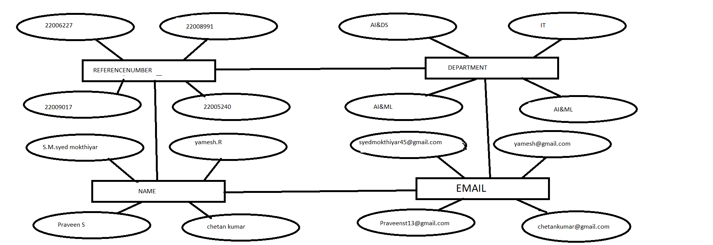
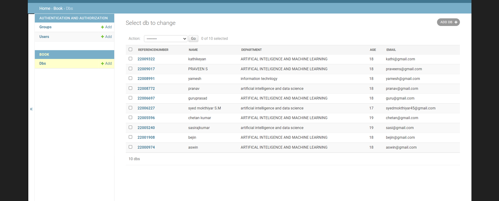

# Django ORM Web Application

## AIM
To develop a Django application to store and retrieve data from a database using Object Relational Mapping(ORM).

## Entity Relationship Diagram


Include your ER diagram here

## DESIGN STEPS

### STEP 1:

### STEP 2:

### STEP 3:

Write your own steps

## PROGRAM
```
admin.py:

from django.contrib import admin
from .models import Studentdetail,StudentdetailAdmin


admin.site.register(Studentdetail,StudentdetailAdmin)
# Register your models here.


models.py:

from django.db import models
from django.contrib import  admin


#Create your models here.
#Create your models here.
# Create your models here.
class Studentdetail(models.Model):
    referencenumber = models.CharField(max_length=10, primary_key=True , help_text="your reference no ")
    name= models.CharField(max_length=100)
    department = models.CharField(max_length=200)
    age=models.IntegerField()
    email=models.EmailField()
class StudentdetailAdmin(admin.ModelAdmin):
    list_display = ('referencenumber', 'name', 'department', 'age', 'email')
```

Include your code here

## OUTPUT


Include the screenshot of your admin page.


## RESULT
